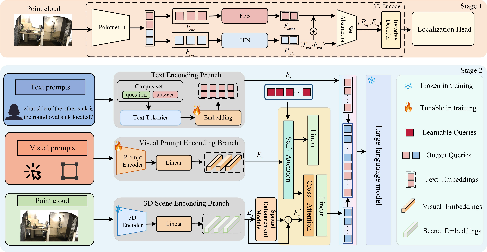

# llm3d

<h1 align="center">
  <strong>A Geometry-Aware Vision-Language Model for 3D Scene Understanding</strong>
</h1>

<p align="center">
  
</p>

## 🌟 Overview

We propose a geometry-aware vision-language model for 3D scene understanding. Taking 3D point clouds and textual instructions as inputs, the proposed method adopts a two-stage training framework to achieve comprehensive modeling from scene-object perception to cross-modal semantic generation.

## 🛠️ Environment Setup

### Install Dependencies

Recommended environment:

```bash
Python 3.8.16
CUDA 11.6
PyTorch 1.13.1+cu116
transformers >= 4.37.0
```

Core packages:

```bash
h5py
scipy
cython
trimesh<2.35.40
networkx<2.3
torch==1.13.1+cu116
transformers>=4.37.0
```

Build extensions:

```bash
cd third_party/pointnet2
python setup.py install
```

```bash
cd utils
python cython_compile.py build_ext --inplace
```

## 📂 Datasets

This repository requires ScanNet 3D data, natural language annotations, and pre-trained LLM weights.

### Step 1. Download and Prepare ScanNet 3D Data

Follow the instructions from [Vote2Cap-DETR ScanNet preprocessing](https://github.com/ch3cook-fdu/Vote2Cap-DETR/tree/master/data/scannet) to download the ScanNetV2 dataset.

Then modify `SCANNET_DIR` in:

```text
data/scannet/batch_load_scannet_data.py
```

Run:

```bash
cd data/scannet
python batch_load_scannet_data.py
```

### Step 2. Prepare Language Annotations

Prepare language annotations from ScanRefer and ScanQA.

ScanRefer:

Follow the instructions from the [ScanRefer repository](https://github.com/daveredrum/ScanRefer).

ScanQA:

Follow the instructions from the [ScanQA dataset documentation](https://github.com/ATR-DBI/ScanQA/blob/main/docs/dataset.md).

### Step 3. Prepare Pre-trained LLM Weights

Download `opt-1.3b` from HuggingFace and place it under:

```text
./facebook/opt-1.3b
```

The folder should include files such as:

```text
config.json
pytorch_model.bin
tokenizer files
```

## 🚀 Getting Started

### Stage 1: Train the 3D Detector

```bash
bash scripts/train_stage1_detector.sh
```

### Stage 2: Multimodal Fine-tuning

```bash
bash scripts/opt-1.3b/tuning.scanqa.sh
```

### Evaluation

```bash
bash scripts/opt-1.3b/eval.scanqa.sh
```

## 📌 Notes

Please make sure that all dataset paths, annotation paths, and LLM checkpoint paths are correctly configured before training or evaluation.
